# Data Architecture for Data Scientists

---
## The million dollar slide / the big picture. 

*Only batch processing architecture here*

- TODO include stream processing
- TODO make prettier

---

## Data warehouse
Diagram to accompany notes.

---
[//]: # (keep this diagram incase i need to make mermaid look "good")

```mermaid


flowchart TD
%% Nodes
Cloud[(☁️ Cloud Service)]
DB1[(🗄️ Database 1)]
DB2[(🗄️ Database 2)]
DB3[(🗄️ Database 3)]
DB4[(🗄️ Database 4)]

    %% Layout links (invisible to control positioning)
    Cloud --> DB1
    Cloud --> DB2
    Cloud --> DB3
    Cloud --> DB4

    %% Optional positioning using subgraphs
    subgraph Top [ ]
        direction LR
        DB1
        DB2
    end

    subgraph Bottom [ ]
        direction LR
        DB3
        DB4
    end

    DB1 -->|Reads/Writes| Cloud
    DB2 -->|Reads/Writes| Cloud
    DB3 -->|Backup| Cloud
    DB4 -->|Analytics| Cloud
```

---

# Data Architecture flowchart

