# Data Architecture for Data Scientists

---

Notes taken from - https://www.udemy.com/course/data-architecture-for-data-scientists

---
# The million $dollah!$ slide

[//]: # (# &#40;TODO&#41; Write diagram in mermaid)

---

# Data warehouse

Diagram to accompany notes.

```mermaid
flowchart TD

subgraph operational_databases
    DB1[(Sales)]
    DB2[(Customer)]
    DB3[(Employee)]
    DB4[(Supplier)]    
end


DW[(Data Warehouse)]

DB1 ----> DW
DB2 ----> DW
DB3 ----> DW
DB4 ----> DW

subgraph external_data - For data enrichment
%% External Datasets
EXT1([🌐 Market Data])
EXT2([📤 Third-Party CRM])
EXT3([📦 Public Demographics])

end

EXT1 --> DW
EXT2 --> DW
EXT3 --> DW

style DW fill:green,stroke:#333,stroke-width:2px

```

---
[//]: # (keep this diagram incase i need to make mermaid look "good")

```mermaid


flowchart TD
%% Nodes
Cloud[(☁️ Cloud Service)]
DB1[(🗄️ Database 1)]
DB2[(🗄️ Database 2)]
DB3[(🗄️ Database 3)]
DB4[(🗄️ Database 4)]

    %% Layout links (invisible to control positioning)
    Cloud --> DB1
    Cloud --> DB2
    Cloud --> DB3
    Cloud --> DB4

    %% Optional positioning using subgraphs
    subgraph Top [ ]
        direction LR
        DB1
        DB2
    end

    subgraph Bottom [ ]
        direction LR
        DB3
        DB4
    end

    DB1 -->|Reads/Writes| Cloud
    DB2 -->|Reads/Writes| Cloud
    DB3 -->|Backup| Cloud
    DB4 -->|Analytics| Cloud
```

---