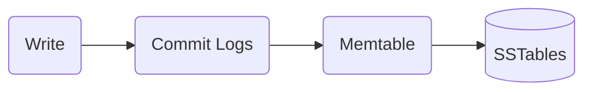

# Apache Cassandra notes

---

Taken from https://www.udemy.com/course/learn-cassandra-from-scratch/learn/lecture/12965920#overview

Official Docs - https://cassandra.apache.org/doc/latest/cassandra/architecture/overview.html

---

## Apache Cassandra Overview

### Intro

- Apache Cassandra is a distributed, decentralised scalable and highly available NoSQL database i.e
  - Distributed / Multiple machines (Cluster)
  - Decentralised - No master slave, identical nodes and no single point of failure, high availability
  - Scalable - Add or remove nodes, little performance impact, no manual intervention (*check*), no manual balancing
- Apache cassandra use cases
  - Large and growing data
  - High availability is important
  - Changing data
  - Consistency is not a concern
- Faster writes

### Cluster Setup

### Understanding the Data Model
- Columns - name value pair
- Row - container for columns referenced by primary key
- Table - container for rows
- Keyspace - container for tables that span one or more nodes
- Cluster - container for keyspace

- Cassandra
  - No joins
  - No foreign keys
  - No flexible queries

### Understanding Partitioning / Clustering Keys

- Primary key = partition key + clustering key
  - Partition Key - Decides how data is distributed across nodes
  - Clustering Key - Decides how data is stored on a single node
- How data is distributed?
  - Every node is assigned a unique token / range of token that determines which row will go to which node.
- How token is generated?
  - A hashing function called partitioner is used to generate token values
- Suppose we have a row with primary key pk1 and clustering key ck1-a and ck1-b
  - Clustering keys determines how data is stored within a single node
  - Rows are sorted by values of clustering keys.

[//]: # (### Partition / Clustering Key Hands on)

### Data types intro

| Type                 | Examples                                                       | Description |
|----------------------|----------------------------------------------------------------|-------------|
| Numeric Data Type    | int, bigInt, smallInt, tinyInt, varInt, float, double, decimal | Row 1C      |
| Textual Data Type    | Text, Varchar                                                  | Row 2C      |
| Collection data type | Set, List, Map                                                 | Row 3C      |
| Other data type      | Boolean, Blob, uuid, timeuuid, user- defined                   | Row 3C      |

- UUID description
  - Universally unique identifier
  - 128-bit hex values
  - prevent duplicates
  - Convenience function uuid()
- TimeUUID description
  - Unique identifer
  - Basd on Mac address, system time and a sequence number
  - Prevent duplicats
  - Has convenience functions

### Data types Hands on

---

## Apache Cassandra Architecture

### Replication

- Must for high availability. Two factors
  - Replication factor - Decides how many copies would be there
  - Replication strategy - Decides which nodes will carry these copies.
    - Simple strategy / Replication Factor: 3
    - NetworkTopology strategy
      - Allows us to specify different replication factors for different data centres

TODO add diagram

### Write consistency

- Increase of decrease consistency
- Trade off between consistency and performance
- Configure consistency for read and write separately

- Write consistency
  - NUmber of replicas on which a write must succeed  before returning to a client
    - One - Coordinator will wait for only one replica node to complete
    - All - Coordinator will wait for all replica nodes to complete
    - Quorum - For value $x$, coordinator will wait for exactly $x$ replicas to complete
    - Local Quorum - For value $x$ we need $x$ nodes to complete the write in the same data centre before sending the success notfication to the client.

### Read consistency
- Read consistency
  - Number of replicas to check for consistency before returning data to a client
    - One - coordinator will only send a request to the fastest node to get the requested data
      - Snitches - provide the information about the fastest node
    - All - 
    - Quorum - Will send a read reqest to the fastest node and will send a digest to one of the replica nodes for a has of the data
    - Local Quorum - if 2, coordinator will send a read requests to 2 replicas in the local data centre

### Gossip Protocol

- Nodes gossips with each other every second to share state info about each other
  - If a node doesn't respond back it will assign a suspicion model to that node which determines the probability of the node being dead or alive
  - Accrual failure detection model
- There is another part called gossiper
  - Gossiper initiated a gossip session with any random node in the cluster

### How do writes happen

Commit Logs
  - Disk file
  - Crash recovery
  - One commit log per node
    - Memtable
      - In memory data structure
      - One memTable pertable
        - SSTable
          - Disk File
          - Immutable

### Cassandra Storage and SSTable

- Bloomfilter
  - Each SSTable has a bloom filter associated
  - It tells us whether a partition key is present or not
  - Can give a false positive
- Row Cache
  - Subset or rows in memory
  - Configurable - All, None, N
- Key Cache
  - Key-Value pair
  - Key: Partition key
  - Value: location of data on disk
- Data file
  - Actual Data is stored
  - Partition and rows
- Partition Index File
  - Location for row in data file for a partition key
- Partition Index Summary File
  - Summary for index file

### How reads happen

- TODO add diagram

### Compaction

- Merges data based on partition key
  - Keeps the data with the latest timestamp
- Removes row with tombstones
  - Deletes old SS tables

---

## Repair Mechanism

- Read Repair
  - Updates inconsistent replicas during read requests to ensure data consistency
- Anti Entropy
  - Syncs data across nodes by comparing and repairing inconsistencies using merkel trees
- Hinted Hands Off
  - Stores writes for downed replicas and delivers them when they're back
- NoDesync
  - Continuously verifies and repairs the data across replicas in the background

---

## Cassandra Configuration and Managing Cluster

---

## Cassandra with Java

---

## Cassandra With Spark

---

## Best Practices and Anti Pattens

---

## Cassandra on cloud