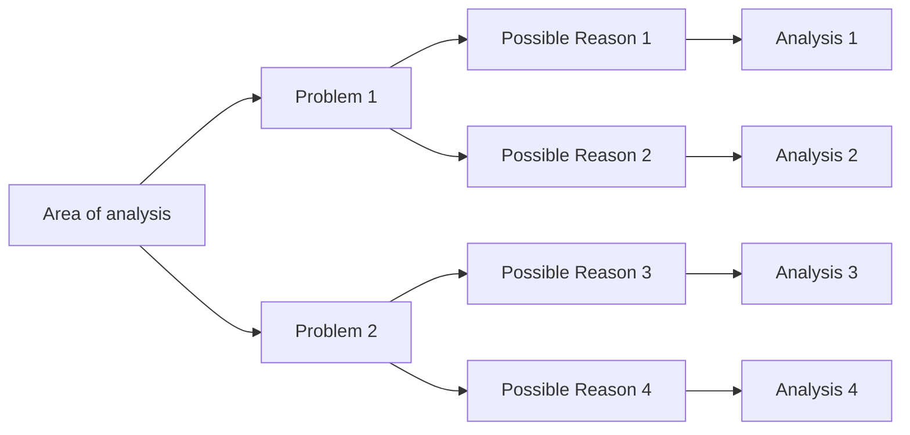

# Some notes on Management consulting frameworks

Taken from www.udemy.com/course/management-consulting-techniques-tools-and-frameworks

*To be used as a starting point*

## Basic Tools

### Bottom-up approach

### Top-down approach

### Backward logic / backward reasoning

### Compounded effect

### Issue tree

### Low-hanging fruits

### Quick wins for cost reduction

### Management Consulting Tools, Techniques and Frameworks Overview

---

## Basic tools, techniques and frameworks - part 2

### Setting Priorities

### 80/20 rule in practice

### Set SMART goals

### Opportunity Tree

### Cost drivers

### KPIs and business drivers - Introduction

### Excel - basic rules for every Management Consultant

### PowerPoint - how it should be used by a business analyst

### Basic tools - Summary

---

## Intermediate tools, techniques and frameworks - part 1

### Intermediate tools - Introduction

### Rankings - Introduction

### Expansion strategy into other countries - Introduction

### Scenario Analysis - Introduction

---

## Intermediate tools, techniques and frameworks - part 2

### Representative element analysis - Introduction

### Decision Tree Analysis

### OEE and OLE

### Theory of constraints and bottlenecks

### What the production capacity depends on?

### Critical chain

### Intermediate tools - Summary

---

## Advanced tools, techniques and frameworks used by management consultants.

### Advanced tools - Introduction

### Simulation analysis - introduction

### Decomposition of effects analysis - Introduction
- Decomposition analysis shows you what are the components driving forces behind certain phenomena.
- Helps achieve certain goals
  - Pick the biggest contributor
  - Will know what to focus on to get the required effect
  - Check to what extent you were dealing with one-offs
  - Create a business model based on drivers and KPIs
  - Forcast and plan the future results
  - Evaluate the business or business unit

### LFL Analysis - Introduction

### Feasibility analysis - introduction

### Sensitivity analysis - Introduction

### Overview of segmentation methods

### How to scale up a business - best practices from top firms

---

Management Consulting Skills

Taken from https://www.udemy.com/course/management-consulting-business-strategy

### Welcome

### Consulting Approach to Problem-Solving

### Consulting Presentation Skills that make an Impact

### Corporate Strategy Analysis

### Industry Analysis

### Financial Analysis

### Operations Analysis

### Other Key Skills

### Conclusion

---

Taken from https://www.udemy.com/course/management-consulting-problem-solving

### Introduction

### Management Consulting

### Explore Management Consulting Cases

### Profitability Case

### Industry Analysis

### Market Entry

### Capacity Expansion

### Merge and Acquisition

### Investment

### Organisation Behaviours

### Brainstorming Cases

### Estimation

### Conclusions

---

Consulting approach to problem-solving https://www.udemy.com/course/consulting-approach-to-problem-solving

### Course structure

### Introduction to structured problem-solving

### Step 1 - Problem Formulation

### Step 2 - Problem Structuring

### Step 3 - Work prioritisation and planning

### Step 4 - Communicating the solution

### Wrap-up

---

Market Research for Management Consultants & Analysts

Taken from https://www.udemy.com/course/market-research-for-management-consultants-analysts

### Introduction

### Estimating Market Size

### Job-to-be-done Framework

### Competitive Landscape

### Market Structure Analyses

### Financial Modelling

### Conclusions

---

Management Consulting Career, Industry and Practice - https://www.udemy.com/course/learn-management-consulting

### Introduction

###

###

###

### Understand How Management Consulting Engagements Work

### Learn the about the value that management consulting offers 😲

### Conclusion