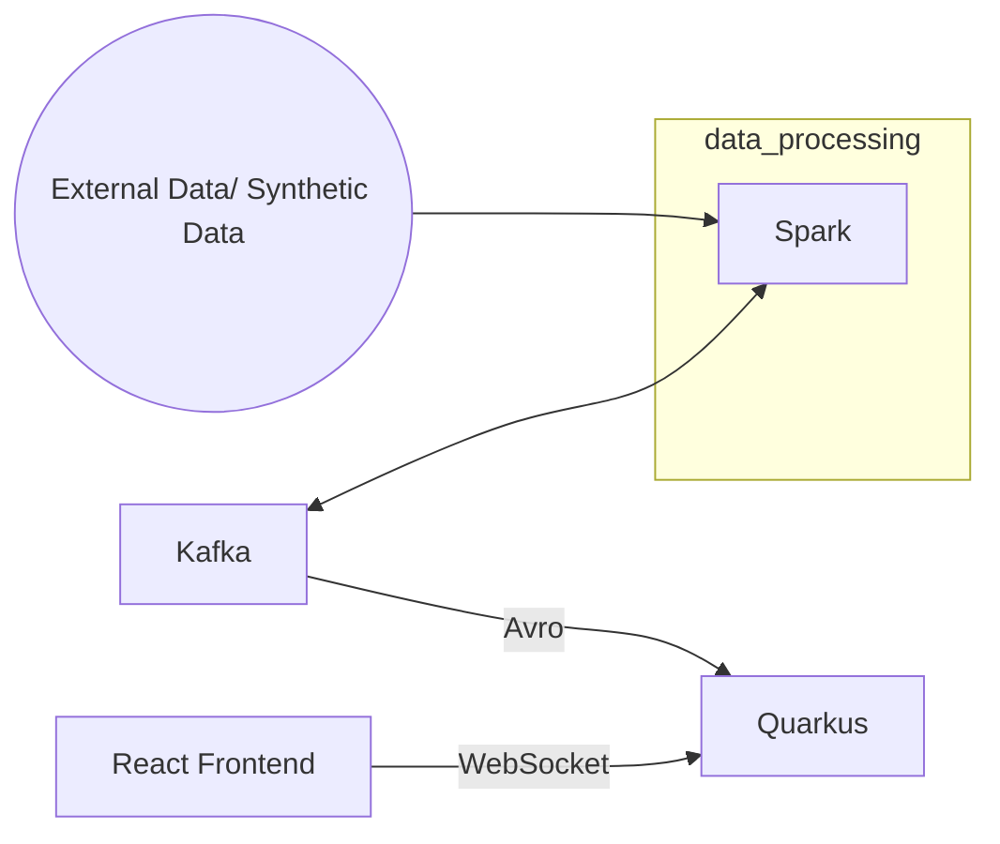

# Sketches of potential data applications

---

### Basic react quarkus applications

- React
    - Nice frontend components
- Quarkus
  - Low memory usage
  - Uses Java
  - Annotations makes development fast at the expense of high abstraction

---

### React / Quarkus / Spark

Potential example architecture using Spark

- Will require more thought - could use Kafka here. Need to consider best way of showing Spark computations via React or other FE framework
  - React for nice frontend.
  - Spark for heavy data processing.

