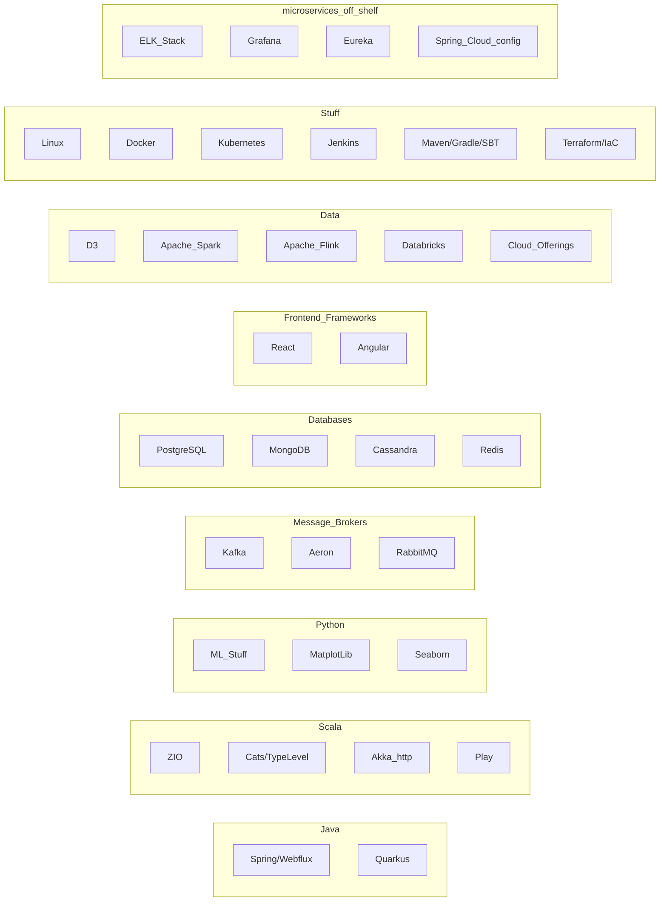

# Stuff map WIP

---

Stuff for building software systems.

---

```mermaid
graph LR
    subgraph Java
        Spring/Webflux
        Quarkus
    end

    subgraph Scala
        ZIO
        Cats/TypeLevel
        Akka_http
        Play
    end

    subgraph Python
        ML_Stuff
        MatplotLib
        Seaborn
    end

    subgraph Message_Brokers
        Kafka
        Aeron
        RabbitMQ
        end

    subgraph Databases
        PostgreSQL
        MongoDB
        Cassandra
        Redis
    end

    subgraph Frontend_Frameworks
        React
        Angular
    end

    subgraph Data
        D3
        Apache_Spark
        Apache_Flink
        Databricks
        Cloud_Offerings
    end

    subgraph Stuff
        Linux
        Docker
        Kubernetes
        Jenkins
        Maven/Gradle/SBT
        Terraform/IaC
    end
    
    subgraph microservices_off_shelf
        ELK_Stack
        Grafana
        Eureka
        Spring_Cloud_config
        
    end
    
```